# Evidencias - Pruebas Unitarias y E2E

**Proyecto:** Sistema de Reservas (taller-Bonilla-VIche-TIpan)
**Materia:** Desarrollo de Software Seguro
**Integrantes:** Reishel Tipan, Jairo Bonilla, Julio Viche

## Descripción

Se identificaron vulnerabilidades en el backend del sistema y se implementaron pruebas unitarias y pruebas E2E (con Playwright) que las evidencian.

## Pruebas Unitarias

### Reishel Tipan

**Vulnerabilidad 1: Autenticación falsa (token forjable)**
**Archivo:** `backend/src/main/java/com/reservas/service/AuthService.java`

El sistema no genera un JWT real. El "token" es únicamente el texto `"admin-token-"` concatenado con la marca de tiempo actual, y el método `validarToken()` solo comprueba que el token recibido comience con ese prefijo. Esto significa que cualquier persona puede construir manualmente un token válido sin conocer ninguna contraseña ni haber iniciado sesión.

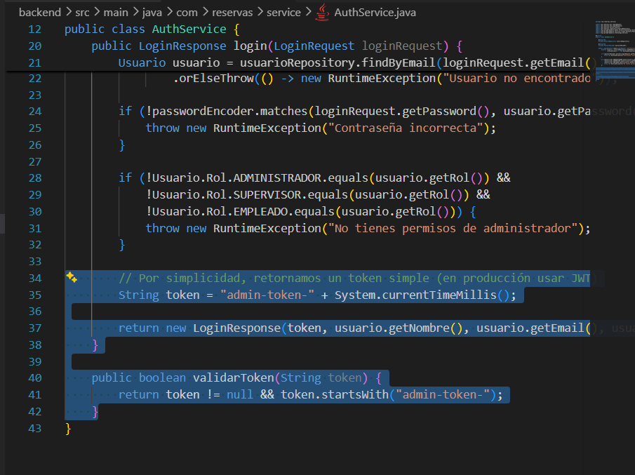

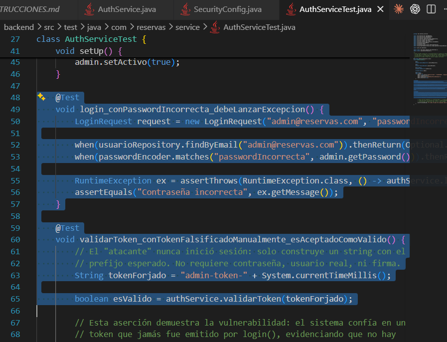

**Vulnerabilidad 2: Autorización rota (endpoints sin protección)**
**Archivo:** `backend/src/main/java/com/reservas/config/SecurityConfig.java`

La configuración de seguridad permite acceso público a rutas sensibles (`/api/usuarios`, `/api/servicios`, `/api/reservas`) y finaliza con `.anyRequest().permitAll()`, dejando todos los endpoints accesibles sin autenticación, incluidas operaciones administrativas como listar, editar o eliminar usuarios.

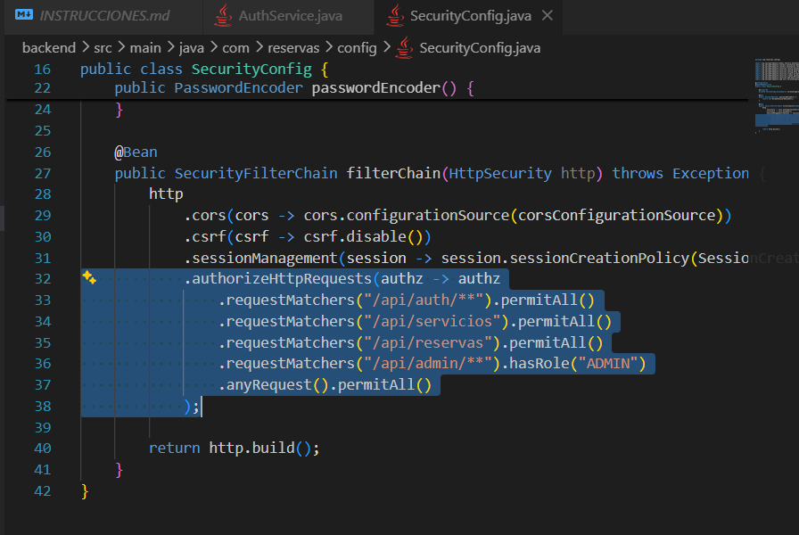

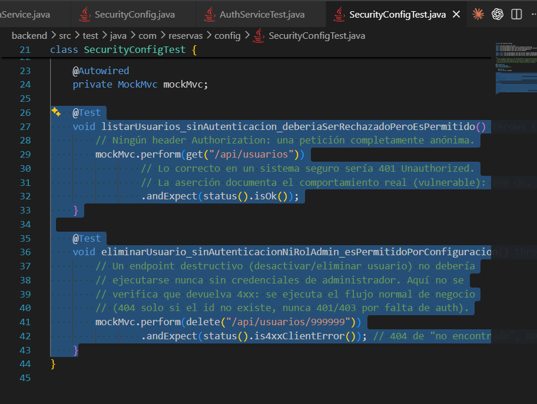

**Ejecución de las pruebas:**

```
Tests run: 2, Failures: 0, Errors: 0, Skipped: 0 -- in com.reservas.config.SecurityConfigTest
Tests run: 2, Failures: 0, Errors: 0, Skipped: 0 -- in com.reservas.service.AuthServiceTest

Tests run: 4, Failures: 0, Errors: 0, Skipped: 0

BUILD SUCCESS
```

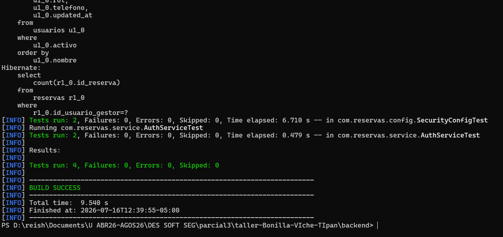

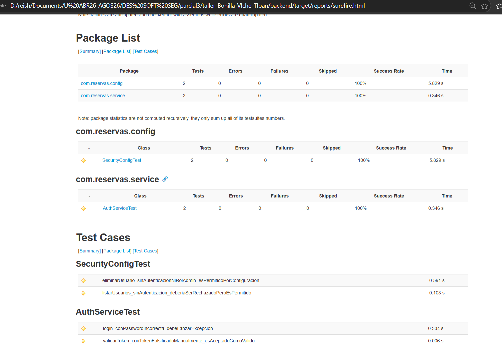

Comando utilizado:

```
mvn "-Dtest=AuthServiceTest,SecurityConfigTest" test
```

### Jairo Bonilla

**Vulnerabilidad 3: CORS mal configurado (wildcard con credenciales)**
**Archivo:** `backend/src/main/java/com/reservas/config/CorsConfig.java`

La configuración de CORS combina `allowedOriginPatterns("*")` con `setAllowCredentials(true)`, permitiendo que cualquier origen realice solicitudes con credenciales incluidas. Esta combinación es insegura: habilita que sitios externos y no confiables consuman la API en nombre de un usuario autenticado.

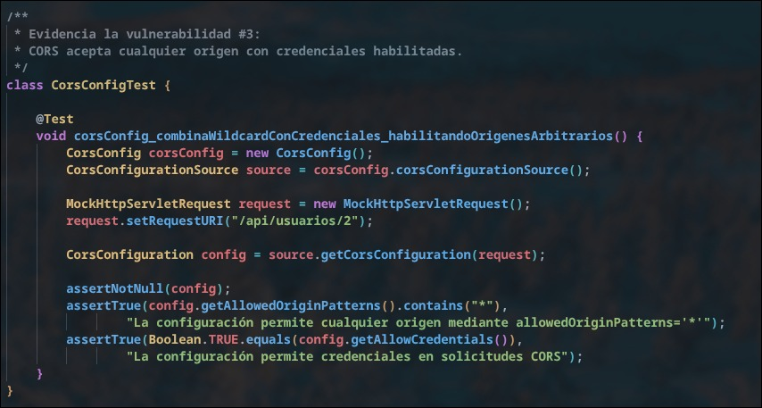

**Vulnerabilidad 4: IDOR - Referencia insegura y directa a objetos**
**Archivo:** `backend/src/main/java/com/reservas/controller/UsuarioController.java`

El endpoint `GET /api/usuarios/{id}` devuelve la información de cualquier usuario a partir de su id, sin validar que quien realiza la solicitud sea el propio usuario o un administrador. Esto permite consultar datos de otras personas simplemente cambiando el id en la URL.

`UsuarioControllerIdorTest.java` (`backend/src/test/java/com/reservas/controller/`) — prueba unitaria que solicita el recurso `/api/usuarios/2` sin autenticación y confirma que el sistema devuelve los datos del usuario sin ninguna verificación de propiedad o rol.

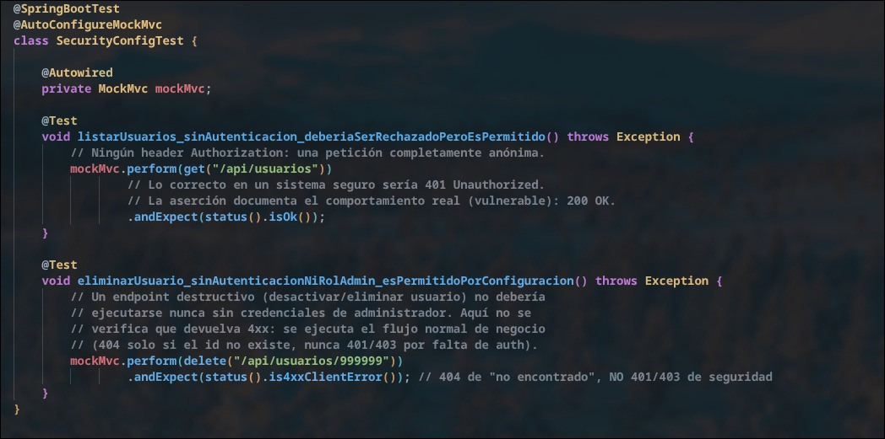

**Ejecución de las pruebas:**

```
Tests run: 1, Failures: 0, Errors: 0, Skipped: 0 -- in com.reservas.controller.UsuarioControllerIdorTest

Tests run: 2, Failures: 0, Errors: 0, Skipped: 0

BUILD SUCCESS
```

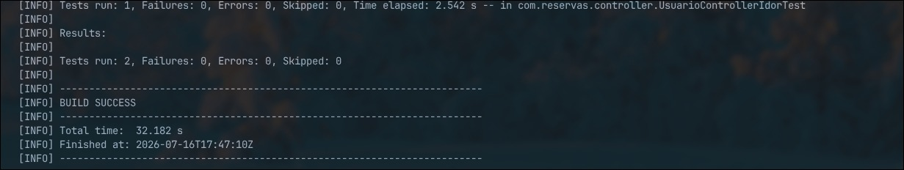

Comando utilizado:

```
mvn "-Dtest=CorsConfigTest,UsuarioControllerIdorTest" test
```

### Julio Viche

**Vulnerabilidad 5: Escalada de privilegios en la gestión de usuarios**
**Archivo:** `backend/src/main/java/com/reservas/service/UsuarioService.java`

El servicio `UsuarioService` permite crear y actualizar usuarios asignando cualquier rol (incluso `ADMINISTRADOR`) sin validar la identidad ni el rol de quien invoca la operación. Combinado con `SecurityConfig` (cualquierRequest permitAll), cualquier petición HTTP anónima puede crear una cuenta de administrador o promover a un usuario existente a `ADMINISTRADOR`.

La clase `UsuarioServicePrivilegeEscalationTest` evidencia tres escenarios:

1. `crearUsuario` con `rol=ADMINISTRADOR` es aceptado sin validar identidad.
2. `actualizarUsuario` promueve a un `CLIENTE` a `ADMINISTRADOR` mediante un simple `PUT`, sin token ni verificación de rol.
3. `eliminarUsuario` realiza un "soft delete" (solo cambia `activo=false`) sin auditoría y sin validar que el solicitante sea administrador.

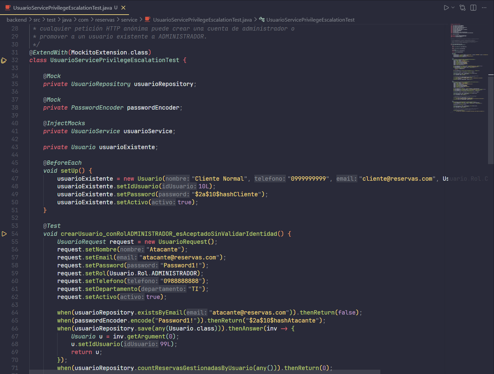

**Ejecución de las pruebas:**

```
Tests run: 3, Failures: 0, Errors: 0, Skipped: 0 -- in com.reservas.service.UsuarioServicePrivilegeEscalationTest

BUILD SUCCESS
```

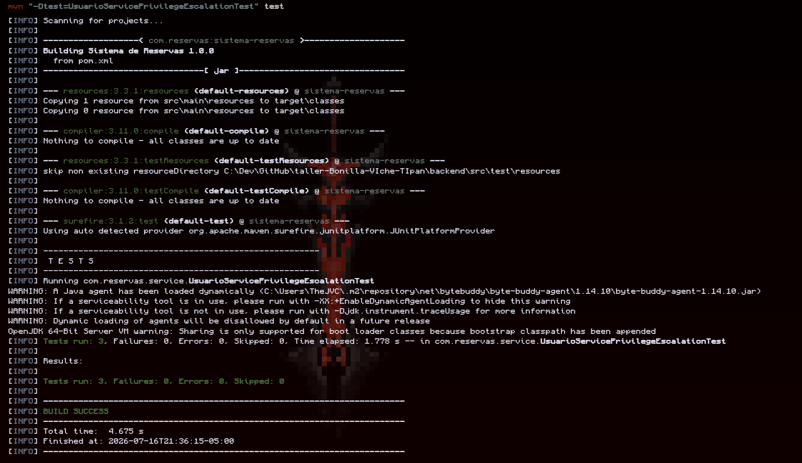

Comando utilizado:

```
mvn "-Dtest=UsuarioServicePrivilegeEscalationTest" test
```

## Pruebas E2E con Playwright

### Reishel Tipan

**Archivo:** `frontend/tests/vuln-reservas.spec.js`

**Vulnerabilidad: Confirmar una reserva sin autenticación (`PUT /api/reservas/{id}/confirmar`)**

El endpoint que confirma una reserva no exige ningún tipo de autenticación. La prueba crea una reserva y luego la confirma mediante `PUT` sin cabecera `Authorization`, confirmando que el backend cambia el estado de la reserva sin verificar identidad ni rol.

**Vulnerabilidad: IDOR al consultar el detalle de una reserva ajena (`GET /api/reservas/{id}`)**

El endpoint de detalle de reserva devuelve nombre, teléfono y email del cliente a partir del id, sin validar que quien consulta tenga relación con esa reserva. La prueba crea una reserva "víctima" y la consulta como si fuera un tercero sin sesión, confirmando que se exponen sus datos privados.

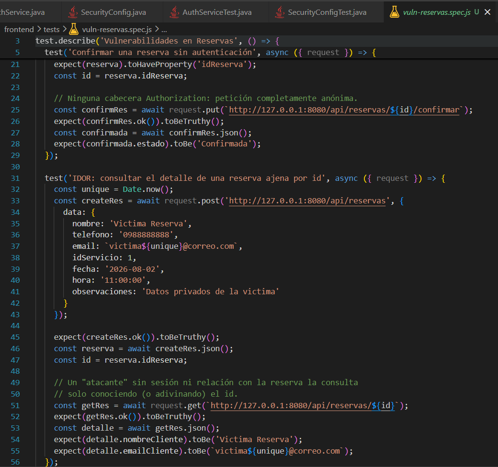

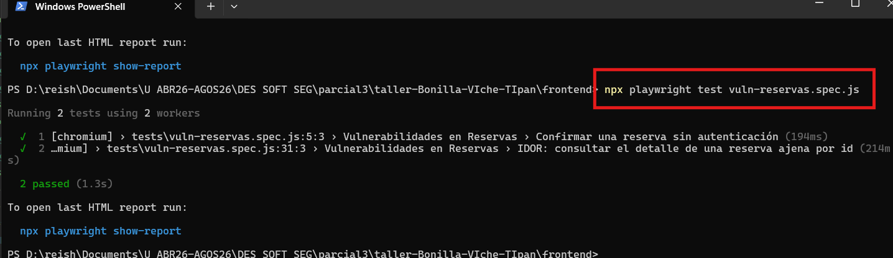

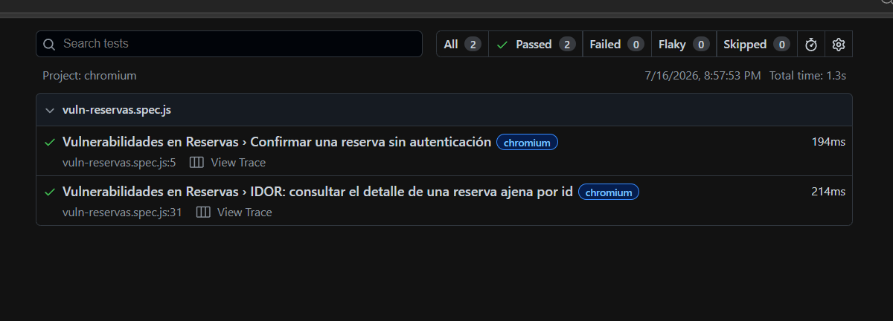

Comando utilizado:

```
npx playwright test vuln-reservas.spec.js
```

### Jairo Bonilla

**Archivo:** `frontend/tests/vuln-nonbasic.spec.js`

**Vulnerabilidad: Exposición de datos sin autenticación (`/api/reportes/resumen`)**

El endpoint de reportes devuelve información agregada del sistema (`totalReservas`, `reservasHoy`) sin exigir ningún tipo de autenticación. La prueba realiza la petición sin cabecera `Authorization` y confirma que el backend responde con éxito y expone los datos.

**Vulnerabilidad: Acción destructiva sin autenticación (`/api/servicios`)**

El endpoint de servicios permite crear y eliminar registros sin autenticación. La prueba crea un servicio arbitrario mediante `POST` y luego lo elimina mediante `DELETE`, ambas operaciones sin credenciales, confirmando que el backend las ejecuta sin ninguna verificación de identidad o rol.

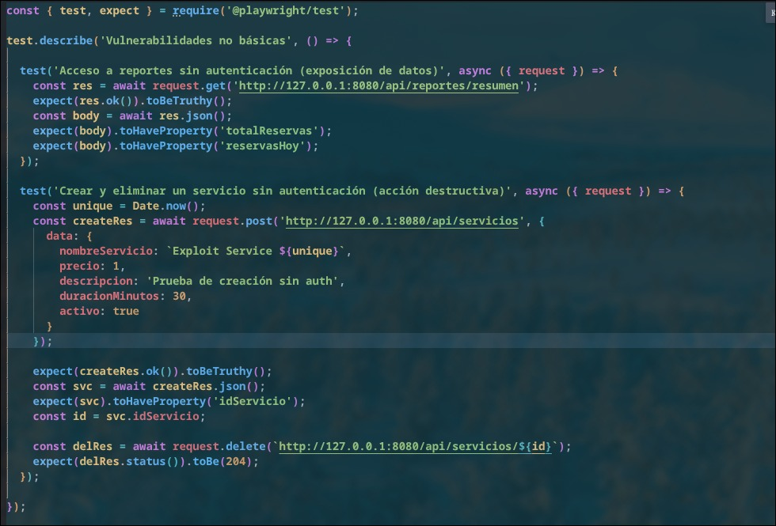

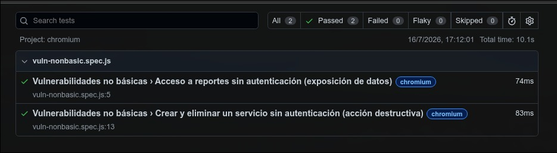

Adicionalmente, en `frontend/tests/frontend-smoke.spec.js` se agregó una prueba E2E de UI que verifica que el formulario de "Nueva Reserva" valida correctamente los campos obligatorios (nombre, teléfono, email, servicio, fecha y hora) antes de permitir el envío.

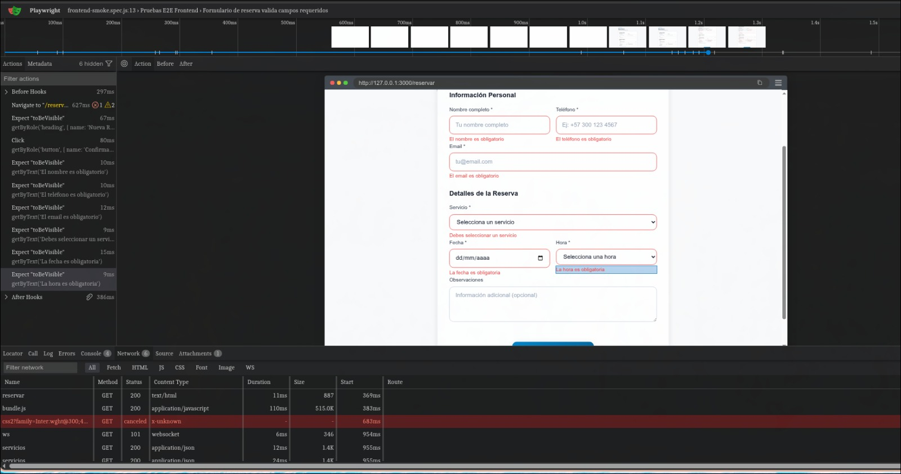

Comando utilizado:

```
npx playwright test
```

### Julio Viche

**Archivo:** `frontend/tests/vuln-usuarios-julio.spec.js`

**Vulnerabilidad: Crear un usuario con rol `ADMINISTRADOR` sin autenticación**

La configuración de seguridad debería rechazar la creación de administradores fuera del módulo `/api/admin`, pero no hay ningún filtro que lo impida. La prueba envía un `POST /api/usuarios` totalmente anónimo asignando `rol=ADMINISTRADOR` y el backend responde con éxito.

**Vulnerabilidad: Promover un `CLIENTE` a `ADMINISTRADOR` sin autenticación**

Se crea primero una víctima como `CLIENTE` y, mediante un `PUT /api/usuarios/{id}` anónimo, se le cambia el rol a `ADMINISTRADOR`. El backend acepta la modificación sin token ni verificación de rol, lo que permite a un atacante escalar privilegios sobre cuentas existentes.

**Vulnerabilidad: Rechazar una reserva sin autenticación**

`PUT /api/reservas/{id}/rechazar` está completamente abierto. La prueba crea una reserva cualquiera y luego la marca como `Rechazada` sin enviar cabecera `Authorization`, confirmando que cualquier persona puede modificar el estado de reservas ajenas.

**Vulnerabilidad: Listar todos los usuarios sin autenticación (enumeración de cuentas)**

`GET /api/usuarios` no exige autenticación. La prueba confirma que un atacante puede enumerar la base completa de usuarios (email, rol, departamento, etc.) sin credenciales.

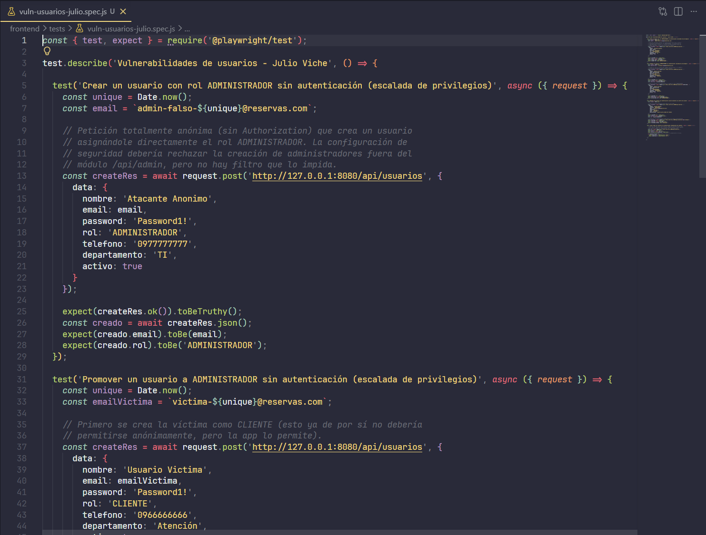

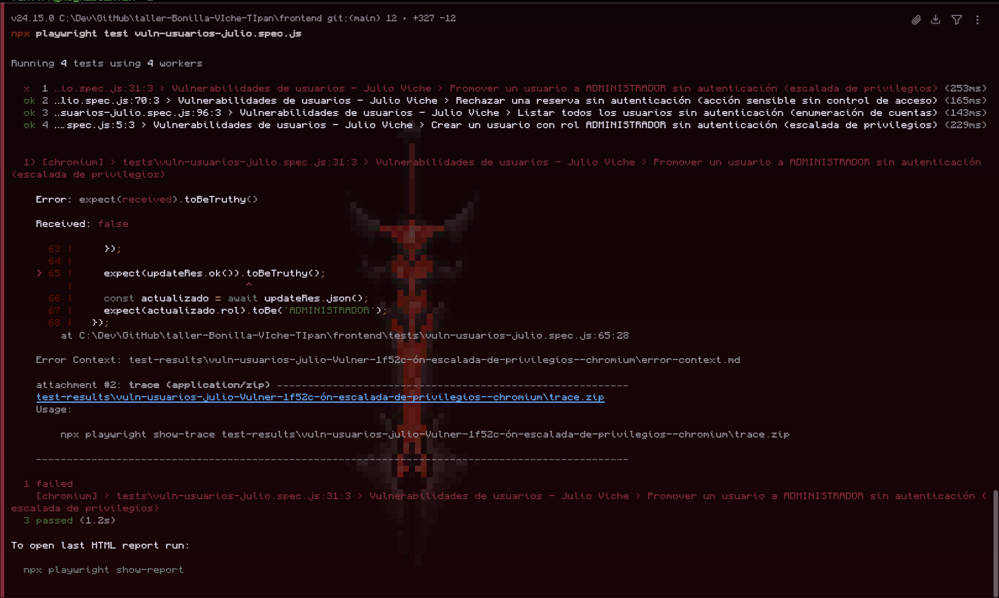

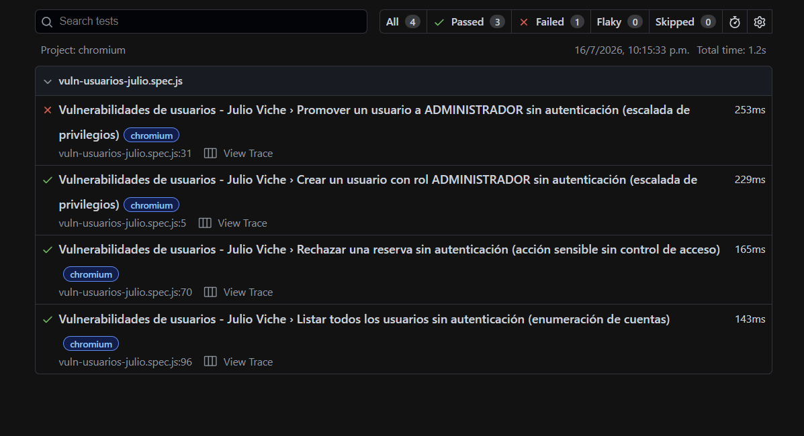

Comando utilizado:

```
npx playwright test vuln-usuarios-julio.spec.js
```
